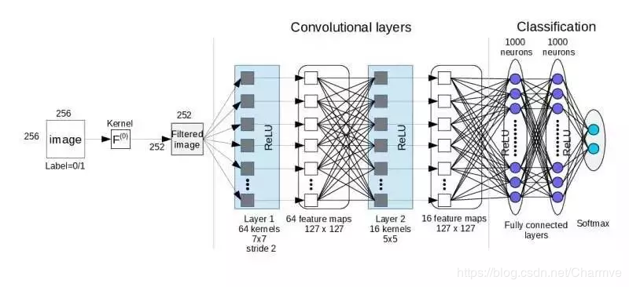
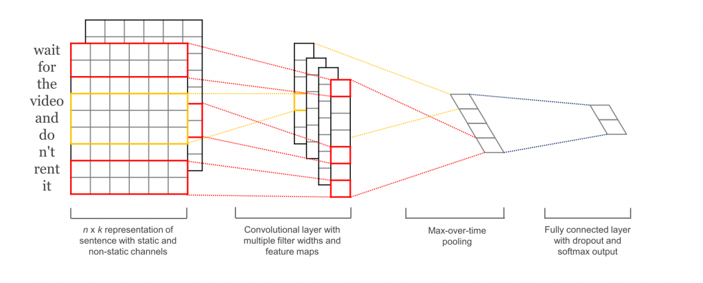
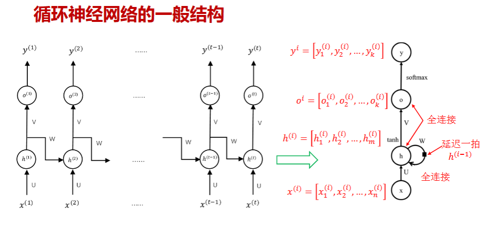
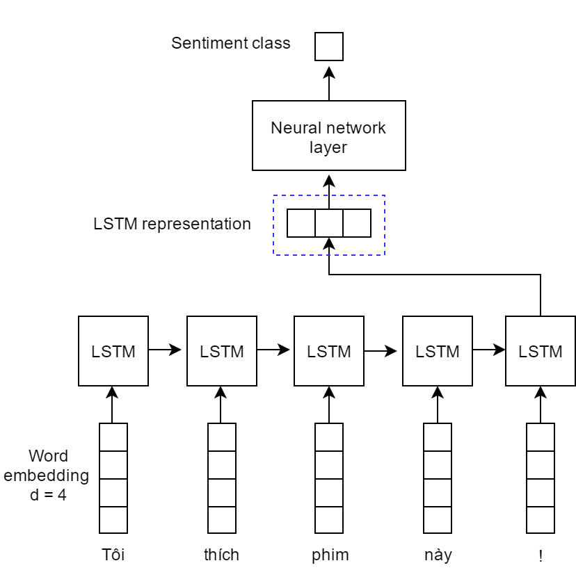

# 情感分类实验报告
> 致理-信计41 张冰喆 2024012092
代码链接https://cloud.tsinghua.edu.cn/f/c1ebe7cf11a1453c9e8e/
## 一、模型结构图
### 1.CNN

这张图片展示了一个典型的卷积神经网络（CNN）用于图像分类的完整架构。
可以将整个结构分为三个大的功能板块：输入与预处理、特征提取层（卷积层）、分类层（全连接层）。
#### 1. 输入与初级过滤 
*   **256x256 Image**: 
    原始输入图像，分辨率为 256x256 像素。
    
*   **Kernel $F^{(0)}$ & 252x252 Filtered image**:
    *   **结构**：通过一个初始卷积核（是 $5 \times 5$ 尺寸，无填充）进行处理。
    *   **作用**：进行初步的特征过滤，减少噪声。输出尺寸变为 252x252 是因为卷积操作带来的边缘缩减（$256-5+1=252$）。

#### 2. 卷积层部分 
这部分由浅入深地理解图像内容。

##### **第一层：Layer 1 (浅层特征)**
*   **结构**：
    *   **64 kernels**: 使用 64 个不同的卷积。
    *   **7x7 stride 2**: 卷积核大小为 $7 \times 7$，步长为 2
    *   **ReLU**: 激活函数
*   **作用**：
    *   **提取基础特征**：如边缘、线条、斑点或简单的纹理。
    *   **降维**：由于步长（stride）为 2，图像尺寸从 252 大约缩减了一半，变为图中所示的 **127x127**。
    *   **非线性化**：ReLU 负责舍弃负值，保留正向特征，使网络能学习复杂的模式。

##### **第二层：Layer 2 (中层特征)**
*   **结构**：
    *   **16 kernels**: 使用 16 个卷积核
    *   **5x5**: 卷积核大小为 $5 \times 5$
    *   **ReLU**: 再次激活
*   **作用**：
    *   **提取复杂特征**：在第一层的基础上，将线条组合成形状或局部特征（如眼睛、轮子、某种特定花纹）。
    *   **特征压缩**：将 64 个特征图重新组合并精简为 16 个特征图

#### 3. 分类层部分 
当特征提取完成后，网络根据这些特征来判断图里是什么。

*   **全连接层**:
    *   **结构**：图中展示了两层各有 1000 个神经元 的全连接层。
    *   **作用**：
        *   **全局整合**：卷积层看的是局部，全连接层负责把所有局部特征拼起来，进行逻辑推理。
*   **ReLU**:
    *   在每一层全连接后使用，防止梯度消失，增加模型的表达能力。

#### 4. 输出层 
*   **Softmax**:
    *   **结构**：最后一层有两个蓝色的神经元,对应 Label=0 或 1。
    *   **作用**：
        *   **概率转换**：将前面层输出的数值（Logits）转换为概率分布（例如：90% 是猫，10% 是狗）。
        *   **决策**：选取概率最高的类别作为最终的预测结果。

### 说明文档中的CNN图片结构解析

#### 1. 输入表示层
*   **结构**：输入是一个 $n \times k$ 的矩阵。其中 $n$ 是句子的长度（单词数），$k$ 是词向量的维度（Embedding Dimension）。
*   **多通道概念**：图中显示了叠在一起的两个矩阵，这代表 **Static（静态）** 和 **Non-static（非静态）** 通道。
    *   **Static Channel**：使用预训练好的词向量（如 Word2Vec），在训练过程中不改变。
    *   **Non-static Channel**：词向量随模型训练而更新（Fine-tuning）。
*   **作用**：将抽象的文字转换成计算机可计算的数值特征，保留了词与词之间的语义关系。

### 2. 卷积层 
*   **结构**：模型使用了多个不同宽度的滤波器（Filters/Kernels）。
    *   **滑窗方式**：与图像卷积不同，文本卷积核的宽度始终与词向量维度 $k$ 相等，只在垂直方向（时间步）滑动。
    *   **不同尺寸**：图中红色和黄色的方框代表不同尺寸的卷积核（例如分别覆盖 2、3 或 4 个单词）。
*   **作用**：**提取局部特征（N-gram 特征）**。
    *   较小的卷积核提取 2 元词组（Bi-gram）特征，较大的提取 3 元或更多元词组的语义特征。这类似于人类阅读时关注短语和固定搭配。

#### 3. 最大池化层 
*   **结构**：对每个卷积核生成的特征图（Feature Map），只取其中的最大值。
*   **作用**：
    *   **捕捉最强信号**：由于句子中对情感贡献最大的往往只是某几个核心词（如“太烂”或“超赞”），最大池化能把全句中最重要的特征提取出来。
    *   **固定长度输出**：无论输入句子是长是短，池化后每个卷积核都只产生一个数值，从而解决了文本长度不一的问题，方便后续接入全连接层。

#### 4. 全连接层与输出层
*   **结构**：
    *   将所有特征图池化后的结果拼接在一起，形成一个长向量。
    *   应用 **Dropout**（训练时随机丢弃神经元）来防止过拟合。
    *   最后接入一个全连接层，输出层使用 **Softmax** 函数。
*   **作用**：
    *   **特征整合**：全连接层将卷积层提取的所有局部 N-gram 特征进行非线性组合。
    *   **分类决策**：Softmax 将最终的数值映射为概率分布（例如正向情感占 0.9，负向占 0.1），从而完成分类。

### 2. RNN

#### 1. 数据变量的结构和作用

*   **$x^{(i)}$ (输入层)**：
    *   **结构**：由 $n$ 个特征组成的向量
    *   **作用**：在时刻 $i$ 输入到网络的信息（如单词的词向量）。
*   **$h^{(i)}$ (隐藏层/状态)**：
    *   **结构**：由 $m$ 个神经元组成的向量
    *   **作用**：模型的“记忆”。它整合了当前输入 $x^{(i)}$ 和上一时刻的记忆 $h^{(i-1)}$。
*   **$o^{(i)}$ (输出层)**：
    *   **结构**：由 $k$ 个神经元组成的向量。
    *   **作用**：模型在当前位置产生的原始预测结果。
*   **$y^{(i)}$ (最终输出)**：
    *   **结构**：经过 **softmax** 处理后的向量。
    *   **作用**：最终的概率分布（比如预测下一个词是什么的概率）。

#### 2. 权重矩阵
图中三个字母 $U, V, W$ 代表了 RNN 需要通过训练来学习的三个参数矩阵：

*   **$U$ (输入到隐藏)**：
    *   **作用**：负责把当前输入的特征 $x$ 提取并转换到隐藏空间。
*   **$W$ (隐藏到隐藏)**：
    *   **作用：**。它负责把上一时刻的记忆 $h^{(i-1)}$ 传递到当前时刻。它决定了模型应该保留多少旧信息。
*   **$V$ (隐藏到输出)**：
    *   **作用**：负责把浓缩后的记忆 $h$ 转化为对外部的预测结果 $o$。

### 说明文档中的LSTM

#### 1. 词嵌入层 
*   **结构**：位于图的最下方。每个单词（如 "Tôi", "thích", "phim"）被转换为一个固定维度的向量（图中 $d=4$）。
*   **作用**：
    *   **语义转化**：将离散的文字转换为机器可以处理的连续数值向量。
    *   **特征表示**：向量中包含了词与词之间的语义关系，相似意思的词在向量空间中的距离会更近。

#### 2. LSTM 隐藏层 
*   **结构**：由一系列相互连接的 LSTM 单元组成。横向的箭头表示信息随时间的流动。
*   **作用**：
    *   **捕捉时序依赖**：由于文本是按顺序阅读的，LSTM 能够“记住”之前出现过的信息，并理解当前词在上下文中的含义。
    *   **处理长距离依赖**：相比普通 RNN，LSTM 特有的“门控机制”（门、输入门、输出门）使其能够有效处理较长句子中的转折或关键信息，避免梯度消失问题。

#### 3. LSTM 特征表示 
*   **结构**：图中蓝色虚线框出的向量，它由**最后一个时刻**（对应标点符号 "!"）的 LSTM 单元输出。
*   **作用**：
    *   **语义浓缩**：这个向量被认为是整个句子的高度浓缩和特征摘要。因为它是在模型读完整个句子后生成的，所以理论上它包含了全句的上下文语义。

#### 4. 神经网络层
*   **结构**：一个全连接神经网络层。
*   **作用**：
    *   **特征映射**：将 LSTM 提取到的抽象语义特征（上一步的向量）映射到分类空间。
    *   **逻辑推理**：通过权重计算和非线性激活函数，学习如何根据特征来区分不同的情感类别。

#### 5. 情感分类输出 
*   **结构**：最顶层的输出单元。
*   **作用**：
    *   **分类决策**：输出最终的预测结果（通常是概率值）。在二分类任务中，它可能输出一个 0 到 1 之间的数值，代表属于“积极”或“消极”情感的概率。

## 二、实验流程描述

在代码中我对比三种不同的模型架构全连接神经网络（MLP）、CNN(TextCNN)、RNN(TextLSTM)，在预训练词向量的基础上完成文本二分类任务。实验流程主要分为**数据预处理**、**模型构建**、**训练策略**以及**结果评估**四个阶段。

### 1. 数据准备与预处理
*   **原始数据加载(load_data)**：从文件夹Dataset读取 `train`、`validation`、`test` 文件，将每行数据解析为整数标签和分词后的单词列表。
*   **词汇表构建与 Embedding 初始化(build_vocab_and_embeddings)**：
    *   加载预训练的 `wiki_word2vec_50.bin` 二进制词向量模型。
    *   建立词汇表（Vocab），设置 `<PAD>` 索引为 0，`<UNK>` 索引为 1。
    *   若词汇在预训练模型中存在，则使用其向量；若不存在（如 `<UNK>` 或随机词），则采用正态分布（`scale=0.1`）随机初始化，最终形成 `embedding_matrix`。
*   **数据序列化处理(TextDataset)**：
    *   将文本转换为索引序列，处理未登录词（OOV）。
    *   **截断与填充**：统一将序列长度处理为 `MAX_LEN (100)`,同时记录下文本的真实长度便于后续模型在最后一个非padding时刻读取`hidden`。
    *   **封装 Dataset**：利用 `TextDataset` 类将索引序列与标签封装，并使用 `DataLoader` 按照 `BATCH_SIZE (64)` 进行批处理和打乱（Shuffle）。
*   **train_data数据增强**
    *   对train_data中的每一个文本随机进行删除、交换两个词、进行同义词替换的方式进行数据增强
#### 2. 模型构建
本实验对比了三种模型(MLP,CNN,LSTM)，均采用 **非冻结（freeze=False）** 的预训练 Embedding 层作为输入：
*   **MLP（多层感知机）**：对词向量序列取 **均值（Mean Pooling）** 压缩时间维度，经过两层全连接网络进行分类。
*   **TextCNN（卷积神经网络）**：
    *   使用并行的三组一维卷积核（`kernel_size` 分别为 3, 4, 5）提取不同窗口长度的局部特征,关注到3元词组，4元词组，5元词组。
    *   通过全局最大池化捕获全句最显著特征并拼接。
*   **TextLSTM（长短期记忆网络）**：
    *   利用 **双向 LSTM（Bi-LSTM）** 捕获句子的前后向时序依赖。
    *   拼接最后一个时间步的正向和反向隐藏状态作为全句表示。

#### 3. 模型训练
*   **环境配置**：模型与数据统一部署于 `DEVICE (CUDA 4060)`。
*   **损失函数与优化器**：
    *   使用 `BCEWithLogitsLoss`（集成 Sigmoid 的二元交叉熵损失），适用于二分类任务且数值稳定性更好。
    *   使用 `Adam` 优化器，设定学习率为 `1e-4`。
*   **早停机制**：
    *   设置 `patience=5`。若验证集损失在连续 5 轮内未下降（下降量小于 `MIN_DELTA`），则提前终止训练。
    *   **参数恢复**：训练结束后自动加载验证集表现最好（Loss最低）的参数模型。

#### 4. 结果评估
*   **评估指标**：计算 **准确率** 、**精确率**、**召回率** 以及 **F1-Score**。
*   **执行流程**：
    1.  对每个模型（MLP、TextCNN、TextLSTM）依次执行训练过程。
    2.  每轮训练结束后，在验证集上即时评估性能并打印指标。
    3.  训练完成后，在测试集上进行最终测评，输出该模型在测试集上的准确率和F1-Score

#### 5. 模型使用
在训练完成后模型会加载F1_score最高的模型，并支持传入一句中文文本，利用jieba库进行分词得到训练数据格式的输入，再利用模型前向传播进行情感分类并输出结果

### 实验参数
| 参数名称 | 数值 | 参数名称 | 数值 |
| :--- | :--- | :--- | :--- |
| **词向量维度** | 50 | **最大序列长度** | 100 |
| **批次大小（可调参）** | 64 | **学习率（可调参）** | 3e-4 |
| **最大迭代轮数** | 50 | **Dropout 概率** | 0.5 |
| **早停耐心值** | 5 | **验证集损失阈值** | 1e-4 |

## 三、实验结果展示
| 模型类型 | 准确率 | 精确率Precision | 召回率 Recall | F1-Score |  
| :--- | :--- | :--- | :--- | :--- |
| MLP | 0.8699 | 0.9162 | 0.8182 | 0.8644| 
| CNN | 0.8482 | 0.8876 | 0.8021| 0.8427 | 
| LSTM | 0.8591 | 0.8947 | 0.8182 | 0.8547 | 

## 四、参数对比分析
| 模型类型 | 学习率 | BATCH_SIZE |准确率 | 精确率Precision | 召回率 Recall | F1-Score | 停止轮数 | 
| :--- | :--- | :--- | :--- | :--- | :--- | :--- | :--- |
| MLP | 1e-3 | 32| 0.8618| 0.8953 |0.8235  |0.8579| 7 | 
| MLP | 1e-3 | 64| 0.8401| 0.9156 |0.7540  |0.8270|8  |
| MLP | 1e-3 | 128| 0.8564| 0.8941 |0.8128  |0.8515|9 |
| MLP | 3e-4 | 32 |0.8618| 0.9096 |0.8075  |0.8555|11 | 
| MLP | 3e-4 | 64 |0.8699| 0.9162 |0.8182  |0.8644|13  | 
| MLP | 3e-4 |128 |0.8482| 0.9018 |0.7861  |0.8400|15  | 
| MLP | 1e-4 | 32 |0.8618 | 0.8953 | 0.8235 | 0.8579| 22 |
| MLP | 1e-4 | 64 |0.8455 | 0.8779 | 0.8075 | 0.8412| 28 | 
| MLP | 1e-4 | 128 |0.8509 | 0.9024 | 0.7914 | 0.8433| 35 | 
| CNN | 1e-3 | 32 |0.8428 | 0.9006 | 0.7754 | 0.8333 | 7 |
| CNN | 1e-3 | 64 |0.8455 | 0.9114 | 0.7701 | 0.8348 | 7 |
| CNN | 1e-3 | 128 |0.8347 | 0.8663 | 0.7968 | 0.8301 | 9 |
| CNN | 3e-4 | 32 |0.8455 | 0.8779 | 0.8075 | 0.8412 | 10 |
| CNN | 3e-4 | 64 |0.8482 | 0.8876 | 0.8021 | 0.8427 | 12 |
| CNN | 3e-4 | 128 |0.8401 | 0.8678 | 0.8075 | 0.8366 | 15 |
| CNN | 1e-4 | 32 |0.8428 | 0.8862 | 0.7914 | 0.8362 | 20 |
| CNN | 1e-4 | 64 |0.8374 | 0.8713 | 0.7968 | 0.8324 | 24 |
| CNN | 1e-4 | 128 |0.8428 | 0.8817 | 0.7968 | 0.8371 | 32 |
| LSTM | 1e-3 | 32 |0.8537 | 0.8889 | 0.8128 | 0.8492 | 8 |
| LSTM | 1e-3 | 64 |0.8591 | 0.8947 | 0.8182 | 0.8547 | 8 |
| LSTM | 1e-3 | 128 |0.8320 | 0.9032 | 0.7487 | 0.8187 | 7 |
| LSTM | 3e-4 | 32 |0.8320| 0.8931 | 0.7594 | 0.8208 | 11 |
| LSTM | 3e-4 | 64 |0.8428| 0.9057 | 0.7701 | 0.8324 | 10 |
| LSTM | 3e-4 | 128 |0.8320| 0.8981 | 0.7540 | 0.8198 | 11 |
| LSTM | 1e-4 | 32 |0.8238 | 0.8547 | 0.7861 | 0.8189 | 14 |
| LSTM | 1e-4 | 64 |0.8320 | 0.8163 | 0.8556 | 0.8355 | 15 |
| LSTM | 1e-4 | 128 |0.8293 | 0.8523 | 0.8021 | 0.8264 | 18 |

### 结论
三类模型的最佳表现分别是：
MLP 为 lr=3e-4，batch_size=64，F1=0.8644；
CNN 为 lr=3e-4, batch_size=64，F1=0.8427；
LSTM 为 lr=1e-3, batch_size=64，F1=0.8547。
综合比较，MLP 整体最稳定、最优；LSTM 次之；CNN 整体略弱。
### 原因分析
#### 学习率影响

对 MLP 和 CNN，3e-4 明显优于 1e-4，也普遍优于 1e-3，说明 3e-4 是更合适的收敛速度：既不会太慢，也不会因为步子太大而震荡。
对 LSTM，1e-3 反而最好，尤其是 batch_size=64 时 F1=0.8547，说明 LSTM 需要更积极一点的更新步长来更快学到时序特征。
1e-4 时三个模型的停止轮数都明显增加，说明学习率偏小，收敛更慢，虽然训练更久，但最终指标并没有更好。
#### Batch Size 影响
batch_size=64 在三种模型中都表现很好，基本是最优或接近最优。
batch_size=128 整体偏弱，尤其在 LSTM 中更明显，如 lr=1e-3 时 F1 从 0.8547 降到 0.8187，说明过大的 batch 可能削弱了参数更新的灵活性，泛化能力下降。
batch_size=32 通常比 128 好，但多数情况下还是略逊于 64，说明太小的 batch 虽然随机性更强，但稳定性略不足。

## 五、 模型比较
### 实验结果
实验结果表明，三种模型中 MLP 的综合性能最好，LSTM 次之，CNN 相对较弱。MLP 在最佳参数配置下取得了最高的准确率 0.8699 和 F1-score 0.8644，说明该情感分类任务更依赖词语本身的语义和情感倾向，而不是复杂的局部模式或长距离上下文关系。CNN 虽然能够提取局部 n-gram 特征，但整体效果不如 MLP 和 LSTM；LSTM 能够建模文本顺序信息，表现优于 CNN，但由于模型更复杂、训练更困难，在该数据集上仍未超过结构更简单的 MLP。
### MLP
* 优点
  * 结构最简单，训练速度快，参数相对少，容易收敛
  * 在本实验中取得了最高的准确率和 F1-score
* 缺点
  * 无法显式建模词序信息
  * 无法很好处理复杂语法、否定结构和长距离依赖
  * 表达能力相对有限，任务复杂时上限可能不高
### CNN
* 优点
  * 擅长提取局部 n-gram 特征，如短语、固定搭配、局部情感模式等
  * 可并行计算，训练效率高于LSTM
* 缺点
  * 更关注局部窗口，难以充分建模长距离依赖 
  * 在本实验中整体性能最低，说明仅靠局部特征不足以最好地区分情感
### RNN/LSTM
* 优点
  * 能够建模序列顺序信息，适合处理上下文依赖
  *  比 CNN 更能理解前后词之间的关系
* 缺点
  * 训练速度慢于 MLP 和 CNN，参数较多
  * 更容易受学习率、batch size 等超参数影响
  * 对这个数据集和情感分类任务而言，顺序建模带来的收益没有超过简单的整体语义表示
### 最终结论

MLP最适合本实验，效果最好，说明数据集更偏向词汇情感信息驱动
CNN：能提取局部模式，但对本任务帮助有限
LSTM：能利用顺序信息，性能优于 CNN，但复杂度更高，且性能最终未超过 MLP
## 六、问题思考
##### 1.实验训练什么时候停止是最合适的？简要陈述你的实现方式，并试分析固定迭代次数与通过验证集调整等方法的优缺点
最合适的停止时机不是固定训练若干轮后强行停止，而是验证集指标不再明显提升时停止。这样能兼顾训练充分和不过拟合。
我的实现方式是采用最大论述+验证集早停，具体来说我在代码中设定全局变量`MAX_EPOCHS=50`,`EARLY_STOPPING_PATIENCE=5`,`MIN_DELTA=1e-4`.
训练过程中在每个epoch后计算验证集损失，如果验证集 loss 下降超过 MIN_DELTA，就保存当前最优参数并清零等待计数；否则等待计数 +1，达到 patience 后提前停止，并恢复到历史最优参数
* 固定迭代次数
  * 优点：
    * 实现简单 
    * 不依赖验证集波动
  * 缺点
    *   容易欠拟合或过拟合；不同模型最佳epoch常常不同，需要反复手工调参。
    *   训练时间长，可能在过拟合后仍训练
* 通过验证集早停
  * 优点
    * 能根据模型真实泛化表现自动停止
    * 更节省训练时间
    * 能有效减轻过拟合
  * 缺点：
    * 对验证集划分比较敏感
    * 如果验证集太小或波动较大，可能提前停得过早
##### 2.实验参数的初始化是怎么做的？不同的方法适合哪些地方？
在`build_vocab_and_embeddings`中我实现了对词向量的初始化。具体实现方式：
* `<PAD>`用于padding， 向量初始化为全零
* `<UNK>` 训练集中未出现和word2vec中未登录词用零均值的高斯分布随机初始化
* 训练集中出现且word2vec中能找到的词汇直接使用word2vec预训练向量，其中设定freeze=False,预训练词向量在训练中会继续微调
* Linear, Conv1d, LSTM中的权重使用pytorch默认初始化

* 零初始化
  * 适合 `<PAD>` 向量、某些偏置项
  * 不适合可学习权重矩阵，这是因为如果把整层权重都初始化成一样的值，神经元会学到相同的东西，无法打破对称性
* 高斯分布初始化
  * 适合：未登录词向量'<UNK>'，某些需要随机起点的参数
  * 优点：简单直接
  * 缺点： 若方差设置不合适，容易导致梯度过大或过小
* 正交初始化
  * 适合 RNN/LSTM/GRU的循环权重矩阵
  * 优点： 更有利于保持序列传播中的梯度稳定， 缓解梯度消失/爆炸
* Xavier初始化
  * 适合：全连接层，卷积层，`tanh/sigmoid`或一般线性层
  * 优点： 控制前向和反向传播的方差， 训练更稳定
* He/Kaiming初始化
  * 适合：带`ReLU`的MLP和CNN
  * 原因： `ReLU`会截断一部分激活，He初始化对此更匹配

一般而言，零初始化适合用于 padding 向量或偏置项，但不适合用于可学习权重；高斯初始化适合未知词向量等场景；正交初始化更适合循环神经网络；而 Xavier 或 He 初始化则更适用于全连接层和卷积层。
##### 3.过拟合是深度学习常见的问题，有什么方法可以方式训练过程陷入过拟合。
* 早停
  * 当验证集性能不再提升时停止训练，避免模型继续记忆训练集噪声
* Dropout
  * 训练时随机失活部分神经元，减少对某些神经元和特征的过度依赖
* 正则化
  * 如L2weight decay, 防止模型权重绝对值过大
* 减小模型复杂度
  * 减少隐藏层维度、卷积通道数、LSTM隐状态维度
* 数据增强
  * 对文本任务使用同义词替换、随机删除、回译、加入轻微噪声等
* 增加训练数据
  * 更多、更丰富的数据通常是最有效的抗过拟合手段
* 交叉验证
  * 通过多次划分验证模型稳定性，降低单次划分偶然性
##### 4.试分析CNN，RNN，全连接神经网络（MLP）三者的优缺点。
* MLP
  * 优点
    * 结构简单，训练速度快，实现成本低
    * 参数相对较少，容易收敛
    * 对“关键词驱动”的文本分类任务往往效果很好
  * 缺点
    * 不能显式建模词序
    * 对否定、转折、长距离依赖等复杂结构处理能力弱
    * 表达能力相对有限
* CNN
  * 优点
    * 擅长提取局部 n-gram 特征
    * 并行性好，训练效率较高
    * 对局部模式明显的句子表现较好
  * 缺点
    * 更关注局部窗口，不擅长建模长距离依赖
    * 对卷积核大小、通道数比较敏感
    * 容易抓到局部强特征，但对整体语义理解有限
* LSTM
  * 优点
    * 能建模序列顺序信息
    * 更适合处理上下文依赖、否定结构、前后语义关系
    * 比纯局部卷积更能利用文本顺序
  * 缺点
    * 训练速度较慢，参数更多
    * 更难训练，对学习率和初始化更敏感
    * 在数据量有限时，不一定比简单模型更有优势
##### 5.训练得到的模型的鲁棒性如何？可以从网上另找一些/爬取一些小规模的数据（也可以自己写或者调大模型接口生成）来进行测试，并将结果和测试集上的结果进行比较。
MLP、CNN、LSTM 在原测试集上都达到了较高的 F1分值
通过调用deepseek,Gemini接口构造了一个包含更多长程关系，有复杂语序、否定和反讽的数据集，位于Dataset/newtest.txt
在前文尝试得出的最佳超参数BATCH_SIZE=64,lr=3e-4的情况下测试新数据集，得到的结果如下
| 模型类型 | 原测试集准确率 | 原测试集精确率Precision | 原测试集召回率 Recall | 原测试集F1-Score | 新测试集准确率 | 新测试集精确率|新测试集召回率|新测试集F1-Score|
| :--- | :--- | :--- | :--- | :--- | :--- | :--- | :--- | :--- |
| MLP | 0.8699 | 0.9162 | 0.8182 | 0.8644| 0.8082 |0.8148 | 0.9167 | 0.8627 |
| CNN | 0.8482 | 0.8876 | 0.8021| 0.8427 | 0.7808 | 0.8137 | 0.8646 | 0.8384 | 
| LSTM | 0.8591 | 0.8947 | 0.8182 | 0.8547 | 0.7945 | 0.8750 | 0.8021 | 0.8370 | 

**实验结论**：
* 三个模型在新测试集上的准确率都下降了，说明新测试集与原测试集之间存在一定的分布差异，模型泛化到新数据时都受到了一定影响。
* 从 F1-score 看，MLP 和 CNN 的下降很小，LSTM 下降相对更明显，从鲁棒性角度看，MLP > CNN > LSTM。
* 两个测试集上，MLP 都保持了最好的 F1-score，说明它在当前任务上仍然是综合表现最稳定的模型。
* MLP 和 CNN 在新测试集上的 Recall 明显上升，而 Precision 有所下降，这表明模型在新数据上更倾向于预测为正类，从而减少了漏判，但增加了误判
* LSTM 的 Precision 和 Recall 均有所下降，说明其对新数据分布更敏感，鲁棒性相对较弱

## 七、 实验心得与体会

在情感分类实验中，我通过构建并对比 MLP、CNN 和 LSTM 三种经典模型，对自然语言处理（NLP）的基础全流程有了深刻的理解。下面是我的心得体会：

#### 1. 对模型复杂度与任务匹配度的重新认识
实验结果中 MLP 表现优于 CNN 和 LSTM 是最令我惊喜的发现。在传统的认知中，我往往认为结构越复杂（如带有时序建模能力的 LSTM）效果一定越好。但通过本次实验我意识到：
*   **数据特性决定模型上限**：本实验的数据集可能更偏向于“关键词驱动”，即文本极性主要由某些高频情感词决定，而复杂的句法结构或长程依赖对最终分类的贡献有限。在这种情况下，MLP 的均值池化能有效过滤噪声，展现出极强的鲁棒性。
*   **奥卡姆剃刀原理**：在深度学习中，如果简单的模型能解决问题，其泛化能力往往比过度设计的复杂模型更强。

#### 2. 超参数微调的工程实践
在参数对比分析中，我观察到学习率（lr）和批大小（batch_size）对模型收敛有着决定性的影响：
*   **学习率的敏感性**：学习率 `3e-4` 在多个模型中表现较好，验证了在小规模数据集上小学习率的重要性。过大的学习率（1e-3）虽然收敛快，但在 LSTM 等复杂模型中极易导致在局部最优解附近震荡。
*   **确定性实验的价值**：在实验中同一份代码不同时候进行训练得到的结果会不同，面对不稳定的输出结果调参失去了参考，我深刻体会到可复现性是深度学习实验的基础。只有确保结果可复现，调参过程才具有科学意义。然而即使设定了seed，由于pytorch中采用非确定算法和浮点数运算累计误差等原因实验结果还是会有偏差

#### 3. 鲁棒性测试中的反思
在引入包含反讽和双重否定的新测试集后，所有模型的表现均有所下滑，这反映了当前模型的局限性：
*   **语义理解的缺失**：目前的模型很大程度上还在进行统计学匹配。例如对于反讽句“真是谢谢导演拍出这种史诗级烂片”，MLP 可能会因为捕捉到“伟大”、“谢谢”等正向词汇而误判。
*   **未来改进方向**：若要进一步提升鲁棒性，需要引入更强的特征提取器（如 Transformer/BERT）或利用注意力机制（Attention）来加重核心逻辑词的权重。

**总结：**
这次实验不仅让我掌握了 PyTorch 构建 NLP 模型的技术细节，更让我明白：算法没有绝对的高下，只有对特定数据的适配与否。 深入理解数据、严谨控制变量、理性对待结果，是通往优秀模型训练者的必经之路。